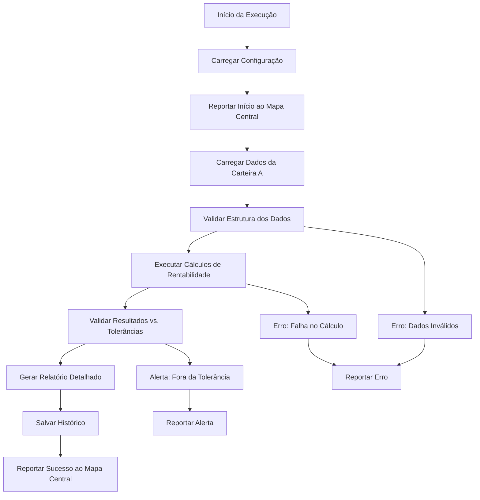

# Rentabilidade Carteira A - Módulo de Conciliação

<div align="center">


**Módulo específico para conciliação de rentabilidade da Carteira A**

[🏗️ Estrutura](#estrutura) • [🔧 Desenvolvimento](#desenvolvimento) • [🚀 Execução](#execução) • [📊 Dados](#dados)

</div>

---

## 🎯 Por que este módulo existe?

### Problema Específico
A **Carteira A** da Galapagos DTVM requer conciliação diária de rentabilidade para:
- ✅ Validar performance calculada vs. sistemas fonte
- ✅ Identificar discrepâncias em valorização de ativos
- ✅ Garantir conformidade regulatória
- ✅ Fornecer dados precisos para relatórios de gestão

### Solução Implementada
Módulo automatizado que:
- 🔍 **Verifica** dados de rentabilidade diariamente
- 📊 **Valida** cálculos de performance
- 🚨 **Alerta** sobre discrepâncias críticas
- 📄 **Gera** relatórios detalhados
- 🔗 **Reporta** status ao mapa central

---

## 🔍 O que este módulo faz?

### Funcionalidades Principais

#### 1. **Carregamento de Dados**
- Lê arquivo `Rentabilidade_Carteira_A_{data}.xlsx`
- Valida estrutura e integridade dos dados
- Processa informações de ativos e performance

#### 2. **Validações Específicas**
- **Consistência temporal** - Sequência de datas válida
- **Integridade de cálculos** - Validar fórmulas de rentabilidade
- **Limites de tolerância** - Verificar variações aceitáveis
- **Completude de dados** - Todos os ativos presentes

#### 3. **Processamento de Resultados**
- Calcula métricas de performance
- Identifica outliers e anomalias
- Gera alertas para discrepâncias
- Consolida resultados para relatório

#### 4. **Integração com Mapa Central**
- Reporta início/progresso/conclusão
- Atualiza dashboard em tempo real
- Registra métricas históricas
- Envia alertas para problemas críticos

---

## ⚙️ Como funciona?

### Fluxo de Execução


### Dados Processados
- **Fonte:** Sistema de Gestão de Carteiras
- **Arquivo:** `Rentabilidade_Carteira_A_{data}.xlsx`
- **Localização:** `C:\Conciliacoes\Rentabilidade\Carteira_A\`
- **Frequência:** Diária
- **Criticidade:** Alta

---

## 🏗️ Estrutura do Módulo

### Arquivos Principais
```
Rentabilidade_Carteira_A/
├── 📖 README.md                # Esta documentação
├── 🐍 conciliacao.py          # Lógica principal (A IMPLEMENTAR)
├── ⚙️ config.json             # Configurações específicas
├── 📊 dados/                  # Dados de entrada e saída
│   ├── entrada/               # Arquivos de input
│   ├── saida/                 # Resultados processados
│   └── historico/             # Backup de execuções
├── 🧪 tests/                  # Testes unitários
│   ├── test_conciliacao.py    # Testes principais
│   ├── test_data/             # Dados para teste
│   └── conftest.py            # Configurações pytest
├── 📚 docs/                   # Documentação técnica
│   ├── regras_negocio.md      # Regras específicas
│   ├── fluxo_processo.md      # Fluxo detalhado
│   └── troubleshooting.md     # Solução de problemas
├── 📓 notebooks/              # Análises exploratórias
│   ├── analise_dados.ipynb    # Análise de dados
│   └── validacao_regras.ipynb # Validação de regras
└── 🔧 utils/                  # Utilitários específicos
    ├── __init__.py
    ├── data_processor.py      # Processamento de dados
    └── validators.py          # Validadores específicos
```

### Configuração Específica
```json
{
  "modulo": {
    "nome": "Rentabilidade_Carteira_A",
    "categoria": "rentabilidade",
    "criticidade": "alta",
    "versao": "1.0.0",
    "responsavel": "Equipe de Riscos"
  },
  "dados": {
    "arquivo_entrada": "Rentabilidade_Carteira_A_{data}.xlsx",
    "caminho_entrada": "C:\\Conciliacoes\\Rentabilidade\\Carteira_A",
    "formato_data": "%Y%m%d",
    "colunas_obrigatorias": [
      "data",
      "codigo_ativo",
      "nome_ativo",
      "quantidade",
      "preco_abertura",
      "preco_fechamento",
      "valor_mercado",
      "rentabilidade_dia",
      "rentabilidade_acumulada"
    ],
    "tipos_dados": {
      "data": "datetime",
      "quantidade": "float",
      "preco_abertura": "float",
      "preco_fechamento": "float",
      "valor_mercado": "float",
      "rentabilidade_dia": "float",
      "rentabilidade_acumulada": "float"
    }
  },
  "validacoes": {
    "tolerancia_rentabilidade": 0.001,
    "valor_minimo_posicao": 1000.00,
    "verificar_duplicatas": true,
    "validar_datas_consecutivas": true,
    "alertar_rentabilidade_extrema": 0.05
  },
  "calculos": {
    "metodo_rentabilidade": "logaritmico",
    "base_calculo": "valor_mercado",
    "considerar_dividendos": true,
    "ajustar_proventos": true
  },
  "saida": {
    "gerar_relatorio_pdf": true,
    "gerar_grafico_performance": true,
    "enviar_email_alertas": false,
    "salvar_historico": true,
    "backup_dados_entrada": true
  },
  "integracao": {
    "reportar_status_central": true,
    "timeout_execucao": 180,
    "retry_attempts": 2,
    "intervalo_progresso": 10
  }
}
```

---

## 🔧 Desenvolvimento

### Template de Implementação
```python
#!/usr/bin/env python3
"""
Conciliação de Rentabilidade da Carteira A - Galapagos DTVM

Este módulo implementa a lógica específica para conciliar dados de
rentabilidade da Carteira A com validações e cálculos específicos.
"""

import pandas as pd
import numpy as np
from datetime import datetime, timedelta
from typing import Dict, Any, Optional
import sys
import os
from pathlib import Path

# Adicionar path do sistema compartilhado
sys.path.append(os.path.join(os.path.dirname(__file__), '..', '..', 'automacao-conciliacoes'))
from shared.base_conciliacao import BaseConciliacao
from shared.status_reporter import StatusReporter

class RentabilidadeCarteiraA(BaseConciliacao):
    """
    Conciliação específica da Rentabilidade da Carteira A.
    
    Esta classe implementa todas as validações e cálculos específicos
    necessários para garantir a integridade dos dados de rentabilidade.
    """
    
    def __init__(self):
        super().__init__(
            nome="Rentabilidade_Carteira_A",
            categoria="rentabilidade",
            criticidade="alta"
        )
        self.status_reporter = StatusReporter()
    
    def executar_conciliacao(self, data_referencia: Optional[str] = None) -> Dict[str, Any]:
        """
        Executa a conciliação específica da Carteira A.
        
        Args:
            data_referencia: Data no formato YYYY-MM-DD
            
        Returns:
            Dict com resultados da conciliação
        """
        try:
            # 1. Reportar início
            self.status_reporter.reportar_inicio(self.nome, self.categoria, self.criticidade)
            self.logger.info("🚀 Iniciando conciliação Rentabilidade Carteira A")
            
            # 2. Validar data de referência
            data_ref = self._validar_data_referencia(data_referencia)
            
            # 3. Carregar dados
            self.status_reporter.reportar_progresso(self.nome, 20, "Carregando dados...")
            dados = self._carregar_dados(data_ref)
            
            # 4. Executar validações
            self.status_reporter.reportar_progresso(self.nome, 50, "Executando validações...")
            resultados = self._executar_validacoes(dados)
            
            # 5. Calcular métricas
            self.status_reporter.reportar_progresso(self.nome, 80, "Calculando métricas...")
            metricas = self._calcular_metricas(dados, resultados)
            
            # 6. Gerar relatório
            self.status_reporter.reportar_progresso(self.nome, 95, "Gerando relatório...")
            relatorio = self._gerar_relatorio(resultados)
            
            # 7. Consolidar resultados finais
            resultado_final = {
                "status": "sucesso",
                "data_referencia": data_ref,
                "total_registros": len(dados) if dados is not None else 0,
                "registros_validos": resultados.get("registros_validos", 0),
                "registros_invalidos": resultados.get("registros_invalidos", 0),
                "alertas": resultados.get("alertas", []),
                "metricas": metricas,
                "arquivo_relatorio": relatorio,
                "timestamp_execucao": datetime.now().isoformat()
            }
            
            # 8. Reportar sucesso
            self.status_reporter.reportar_sucesso(self.nome, resultado_final)
            self.logger.info("✅ Conciliação Carteira A concluída com sucesso")
            
            return resultado_final
            
        except Exception as e:
            # Reportar erro
            erro_msg = f"Erro na conciliação: {str(e)}"
            self.status_reporter.reportar_erro(self.nome, erro_msg)
            self.logger.error(f"❌ {erro_msg}")
            raise
    
    def _carregar_dados(self, data_referencia: str) -> pd.DataFrame:
        """
        Carrega dados específicos da Carteira A.
        
        Args:
            data_referencia: Data de referência
            
        Returns:
            DataFrame com dados carregados
        """
        # TODO: Implementar carregamento específico
        config_dados = self.config.get("dados", {})
        
        # Formatar nome do arquivo
        data_formatada = datetime.strptime(data_referencia, "%Y-%m-%d").strftime(
            config_dados.get("formato_data", "%Y%m%d")
        )
        nome_arquivo = config_dados.get("arquivo_entrada", "").replace("{data}", data_formatada)
        caminho_completo = os.path.join(config_dados.get("caminho_entrada", ""), nome_arquivo)
        
        self.logger.info(f"📁 Carregando arquivo: {caminho_completo}")
        
        # Verificar se arquivo existe
        if not os.path.exists(caminho_completo):
            raise FileNotFoundError(f"Arquivo não encontrado: {caminho_completo}")
        
        # Carregar dados (implementar lógica específica)
        # df = pd.read_excel(caminho_completo)
        # return df
        
        # Por enquanto, retornar DataFrame vazio para estrutura
        return pd.DataFrame()
    
    def _executar_validacoes(self, dados: pd.DataFrame) -> Dict[str, Any]:
        """
        Executa validações específicas da Carteira A.
        
        Args:
            dados: DataFrame com dados a validar
            
        Returns:
            Resultados das validações
        """
        # TODO: Implementar validações específicas
        validacoes_config = self.config.get("validacoes", {})
        
        resultados = {
            "registros_validos": 0,
            "registros_invalidos": 0,
            "erros": [],
            "alertas": [],
            "validacoes_executadas": [
                "estrutura_dados",
                "colunas_obrigatorias", 
                "tipos_dados",
                "duplicatas",
                "datas_consecutivas",
                "tolerancia_rentabilidade",
                "valores_extremos"
            ]
        }
        
        self.logger.info("🔍 Executando validações específicas da Carteira A")
        
        # Implementar cada validação específica aqui
        
        return resultados
    
    def _calcular_metricas(self, dados: pd.DataFrame, validacoes: Dict[str, Any]) -> Dict[str, Any]:
        """
        Calcula métricas específicas da Carteira A.
        
        Args:
            dados: DataFrame com dados
            validacoes: Resultados das validações
            
        Returns:
            Métricas calculadas
        """
        # TODO: Implementar cálculos específicos
        return {
            "rentabilidade_dia": 0.0,
            "rentabilidade_acumulada": 0.0,
            "valor_total_carteira": 0.0,
            "numero_ativos": 0,
            "maior_posicao": 0.0,
            "menor_posicao": 0.0,
            "tempo_execucao": 0.0,
            "taxa_sucesso": 100.0
        }

# Execução direta do módulo
if __name__ == "__main__":
    import argparse
    
    parser = argparse.ArgumentParser(description="Conciliação Rentabilidade Carteira A")
    parser.add_argument("--data", help="Data de referência (YYYY-MM-DD)")
    parser.add_argument("--debug", action="store_true", help="Modo debug")
    
    args = parser.parse_args()
    
    if args.debug:
        import logging
        logging.getLogger().setLevel(logging.DEBUG)
    
    try:
        conciliacao = RentabilidadeCarteiraA()
        resultado = conciliacao.executar_conciliacao(args.data)
        
        print(f"✅ Conciliação executada com sucesso!")
        print(f"📊 Registros processados: {resultado.get('total_registros', 0)}")
        print(f"📈 Taxa de sucesso: {resultado.get('metricas', {}).get('taxa_sucesso', 0):.1f}%")
        
    except Exception as e:
        print(f"❌ Erro na execução: {e}")
        sys.exit(1)
```

---

## 🚀 Como Executar

### Execução Direta
```bash
# Navegar para o módulo
cd conciliacoes/Rentabilidade_Carteira_A

# Executar para data atual
python conciliacao.py

# Executar para data específica
python conciliacao.py --data 2025-06-07

# Executar em modo debug
python conciliacao.py --debug
```

### Via Mapa Central
```bash
# Executar apenas este módulo
cd automacao-conciliacoes
python mapa_central.py --modulos "Rentabilidade_Carteira_A"

# Executar toda categoria rentabilidade
python mapa_central.py --categoria rentabilidade
```

### Via Jupyter Notebook
```python
# Importar e executar
from conciliacao import RentabilidadeCarteiraA

conciliacao = RentabilidadeCarteiraA()
resultado = conciliacao.executar_conciliacao('2025-06-07')

# Analisar resultados
print(f"Status: {resultado['status']}")
print(f"Registros: {resultado['total_registros']}")
print(f"Alertas: {len(resultado['alertas'])}")
```

---

## 📊 Dados e Validações

### Estrutura de Dados Esperada
| Coluna | Tipo | Obrigatória | Descrição |
|--------|------|-------------|-----------|
| data | datetime | ✅ | Data de referência |
| codigo_ativo | string | ✅ | Código do ativo |
| nome_ativo | string | ✅ | Nome do ativo |
| quantidade | float | ✅ | Quantidade em carteira |
| preco_abertura | float | ✅ | Preço de abertura |
| preco_fechamento | float | ✅ | Preço de fechamento |
| valor_mercado | float | ✅ | Valor de mercado |
| rentabilidade_dia | float | ✅ | Rentabilidade do dia |
| rentabilidade_acumulada | float | ✅ | Rentabilidade acumulada |

### Validações Implementadas
1. **📋 Estrutura de dados** - Verificar colunas obrigatórias
2. **🔢 Tipos de dados** - Validar tipos corretos
3. **📅 Datas consecutivas** - Verificar sequência temporal
4. **🔍 Duplicatas** - Identificar registros duplicados
5. **📊 Tolerâncias** - Verificar limites de rentabilidade
6. **⚠️ Valores extremos** - Alertar para variações anômalas
7. **💰 Valores mínimos** - Verificar posições mínimas

### Métricas Calculadas
- **Rentabilidade do dia** - Performance diária da carteira
- **Rentabilidade acumulada** - Performance desde início do período
- **Valor total** - Valor de mercado total da carteira
- **Número de ativos** - Quantidade de ativos em carteira
- **Concentração** - Análise de concentração por ativo

---

## 🧪 Testes

### Estrutura de Testes
```python
# tests/test_conciliacao.py
import pytest
import pandas as pd
from datetime import datetime
import sys
import os

sys.path.append(os.path.dirname(os.path.dirname(__file__)))
from conciliacao import RentabilidadeCarteiraA

class TestRentabilidadeCarteiraA:
    
    def setup_method(self):
        """Setup para cada teste."""
        self.conciliacao = RentabilidadeCarteiraA()
    
    def test_inicializacao(self):
        """Testa inicialização do módulo."""
        assert self.conciliacao.nome == "Rentabilidade_Carteira_A"
        assert self.conciliacao.categoria == "rentabilidade"
        assert self.conciliacao.criticidade == "alta"
    
    def test_validacao_data_referencia(self):
        """Testa validação de data de referência."""
        # Data válida
        data_valida = self.conciliacao._validar_data_referencia("2025-06-07")
        assert data_valida == "2025-06-07"
        
        # Data inválida
        with pytest.raises(ValueError):
            self.conciliacao._validar_data_referencia("2025-13-01")
    
    def test_carregar_dados_arquivo_inexistente(self):
        """Testa carregamento com arquivo inexistente."""
        with pytest.raises(FileNotFoundError):
            self.conciliacao._carregar_dados("2025-06-07")
    
    def test_validacoes_dados_vazios(self):
        """Testa validações com dados vazios."""
        df_vazio = pd.DataFrame()
        resultado = self.conciliacao._executar_validacoes(df_vazio)
        
        assert "registros_validos" in resultado
        assert "registros_invalidos" in resultado
        assert "erros" in resultado
    
    def test_calcular_metricas(self):
        """Testa cálculo de métricas."""
        df_teste = pd.DataFrame()
        validacoes = {"registros_validos": 0, "registros_invalidos": 0}
        
        metricas = self.conciliacao._calcular_metricas(df_teste, validacoes)
        
        assert "rentabilidade_dia" in metricas
        assert "valor_total_carteira" in metricas
        assert "taxa_sucesso" in metricas

# Executar testes
if __name__ == "__main__":
    pytest.main([__file__])
```

---

## 📚 Documentação Adicional

### Regras de Negócio
- **Tolerância de rentabilidade:** ±0.1% para variações diárias
- **Valor mínimo de posição:** R$ 1.000,00
- **Alerta para rentabilidade extrema:** ±5% em um dia
- **Método de cálculo:** Logarítmico para rentabilidade
- **Consideração de proventos:** Incluir dividendos e JCP

### Troubleshooting
- **Arquivo não encontrado:** Verificar caminho e nome do arquivo
- **Erro de formato:** Validar estrutura do Excel
- **Timeout:** Verificar tamanho do arquivo e performance
- **Dados inconsistentes:** Revisar cálculos no sistema fonte

---

## 🔮 Próximos Passos

### Implementação Imediata
1. **Desenvolver lógica** de carregamento de dados
2. **Implementar validações** específicas
3. **Criar cálculos** de métricas
4. **Testar** com dados reais

### Melhorias Futuras
1. **Machine Learning** para detecção de anomalias
2. **Integração** com sistema de gestão
3. **Alertas inteligentes** baseados em padrões
4. **Visualizações** avançadas de performance

---

<div align="center">

**Módulo Rentabilidade Carteira A - Galapagos DTVM**

*Estrutura pronta para desenvolvimento da lógica específica*

**Criticidade: Alta | Categoria: Rentabilidade**

</div>

