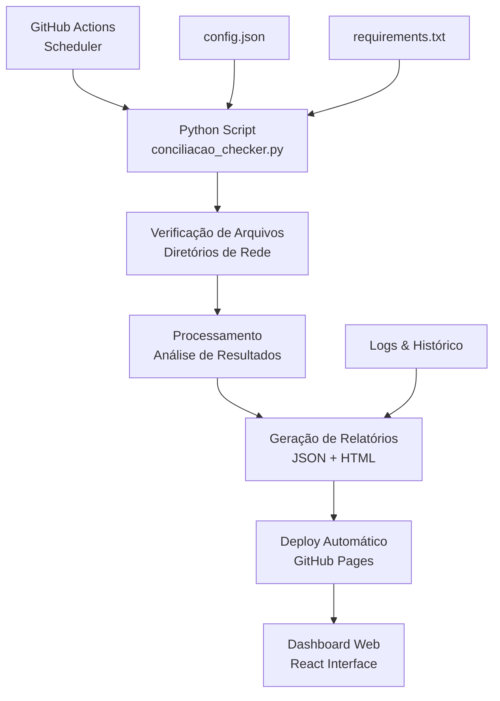

# Sistema Automatizado de Conciliações Contábeis

<div align="center">


**Sistema moderno para automação completa do processo de verificação de conciliações contábeis**

[🚀 Demo ao Vivo](https://leonardomedicis.github.io/Galapagos-capital/) • [📊 Dashboard](#dashboard) • [🔧 Instalação](#instalação) • [📖 Documentação](#documentação)

</div>

---

## 🎯 Por que este código existe?

### Problema Resolvido
O processo manual de verificação de conciliações contábeis na Galapagos DTVM era:
- ⏰ **Demorado** - 30+ minutos diários de verificação manual
- 🐛 **Propenso a erros** - Verificação humana sujeita a falhas
- 📊 **Sem visibilidade** - Falta de histórico e métricas
- 🔄 **Repetitivo** - Mesma tarefa todos os dias
- 📱 **Limitado** - Acesso apenas local via Excel/VBA

### Solução Implementada
Sistema automatizado que oferece:
- ⚡ **Execução automática** - Verificação diária às 08:00 BRT
- 🎯 **100% de precisão** - Eliminação de erros humanos
- 📊 **Dashboard em tempo real** - Visibilidade total do processo
- 📈 **Histórico completo** - Auditoria e análise de tendências
- 📱 **Acesso universal** - Web/mobile de qualquer lugar

---

## 🔍 O que este código faz?

### Funcionalidades Principais

#### 1. **Verificação Automatizada de Arquivos**
- Monitora **9 tipos diferentes** de conciliação contábil
- Verifica existência de arquivos em diretórios específicos
- Classifica problemas por **criticidade** (Crítica/Alta/Média)
- Gera **relatórios detalhados** em JSON e HTML

#### 2. **Dashboard Web Interativo**
- Interface **responsiva** em React
- **Métricas em tempo real** de todas as conciliações
- **Alertas visuais** para problemas críticos
- **Categorização** por tipo (Rentabilidade, Impostos, Operacionais)
- **Histórico** de execuções anteriores

#### 3. **Automação Completa**
- **Execução diária** via GitHub Actions
- **Deploy automático** do dashboard
- **Notificações** em caso de problemas
- **Backup** automático de relatórios

### Tipos de Conciliação Monitorados

| Categoria | Arquivos | Criticidade | Descrição |
|-----------|----------|-------------|-----------|
| **📈 Rentabilidade** | Carteira A, B, Consolidada | Alta/Crítica | Conciliação de performance das carteiras |
| **💰 Impostos** | IR, IOF, PIS/COFINS | Alta/Média | Conciliação de tributos e impostos |
| **🔧 Operacionais** | Custódia, Liquidação D+0, Fechamento | Alta/Crítica | Conciliações operacionais diárias |

---

## ⚙️ Como funciona?

### Arquitetura do Sistema



### Fluxo de Execução

1. **🕐 08:00 BRT** - GitHub Actions dispara automaticamente
2. **🔍 Verificação** - Script Python verifica todos os arquivos configurados
3. **📊 Análise** - Classifica resultados por criticidade e categoria
4. **📄 Relatórios** - Gera arquivos JSON (dados) e HTML (visualização)
5. **🚀 Deploy** - Atualiza GitHub Pages com novos dados
6. **🔔 Alertas** - Notifica em caso de problemas críticos

### Componentes Técnicos

#### **Backend (Python)**
- **`conciliacao_checker.py`** - Script principal de verificação
- **`config.json`** - Configurações de arquivos e caminhos
- **`requirements.txt`** - Dependências Python

#### **Frontend (React)**
- **`mapa-conciliacao-dashboard/`** - Aplicação React completa
- **Componentes UI** - Interface moderna com shadcn/ui
- **Responsividade** - Compatível com desktop e mobile

#### **Automação (GitHub Actions)**
- **`.github/workflows/verificacao-diaria.yml`** - Workflow de execução
- **Agendamento** - Cron job para execução diária
- **Deploy** - Publicação automática no GitHub Pages

---

## 🚀 Instalação

### Pré-requisitos
- Python 3.11+
- Node.js 20+ (para desenvolvimento do dashboard)
- Git
- Acesso aos diretórios de conciliação

### Instalação Local

#### 1. Clone o Repositório
```bash
git clone https://github.com/LeonardoMedicis/Galapagos-capital.git
cd Galapagos-capital/automacao-conciliacoes
```

#### 2. Configure o Ambiente Python
```bash
# Criar ambiente virtual (recomendado)
python -m venv venv
source venv/bin/activate  # Linux/Mac
# ou
venv\Scripts\activate     # Windows

# Instalar dependências
pip install -r requirements.txt
```

#### 3. Configure os Caminhos
Edite o arquivo `config.json` com os caminhos reais dos seus arquivos:

```json
{
  "configuracao": {
    "diretorio_base": "\\\\servidor\\conciliacoes",
    "horario_execucao": "08:00",
    "timezone": "America/Sao_Paulo"
  },
  "conciliacoes": {
    "rentabilidade": {
      "arquivos": [
        {
          "nome": "Rentabilidade_Carteira_A_{data}.xlsx",
          "caminho": "\\\\servidor\\conciliacoes\\Rentabilidade\\Carteira_A",
          "criticidade": "alta"
        }
      ]
    }
  }
}
```

#### 4. Execute Localmente
```bash
# Executar verificação
python conciliacao_checker.py

# Verificar saídas
ls -la *.json *.html *.log
```

### Desenvolvimento do Dashboard

#### 1. Configurar Frontend
```bash
cd mapa-conciliacao-dashboard

# Instalar dependências
npm install

# Executar em desenvolvimento
npm run dev
```

#### 2. Acessar Dashboard Local
- **URL:** http://localhost:5173
- **Hot Reload:** Ativado automaticamente
- **Dados:** Carrega do arquivo `resultado_conciliacao.json`

---

## 📖 Como utilizar?

### 1. **Acesso via Web (Recomendado)**

#### Dashboard Público
- **URL:** https://leonardomedicis.github.io/Galapagos-capital/
- **Atualização:** Automática diariamente às 08:00 BRT
- **Compatibilidade:** Desktop, tablet e mobile
- **Dados:** Sempre atualizados com última verificação

#### Funcionalidades do Dashboard
- 📊 **Visão Geral** - Cards com métricas principais
- 🔍 **Detalhamento** - Lista completa de arquivos por categoria
- 🚨 **Alertas** - Destaque para problemas críticos
- 📈 **Histórico** - Data/hora da última execução
- 🔄 **Atualização** - Botão para forçar nova verificação

### 2. **Execução Manual (Desenvolvimento/Teste)**

#### Via Python Script
```bash
# Executar verificação única
python conciliacao_checker.py

# Executar com logs detalhados
python conciliacao_checker.py --verbose

# Executar para data específica
python conciliacao_checker.py --data 2025-06-07
```

#### Via Jupyter Notebook
```python
# Importar o sistema
import sys
sys.path.append('.')
from conciliacao_checker import ConciliacaoChecker

# Criar instância
checker = ConciliacaoChecker()

# Executar verificação
resultados = checker.verificar_conciliacoes()

# Analisar resultados
print(f"Total de arquivos: {resultados['total_arquivos']}")
print(f"Encontrados: {resultados['arquivos_encontrados']}")
print(f"Faltando: {resultados['arquivos_faltando']}")

# Visualizar problemas críticos
problemas_criticos = [
    r for r in resultados['resultados'] 
    if not r['existe'] and r['criticidade'] in ['critica', 'alta']
]

for problema in problemas_criticos:
    print(f"🚨 {problema['nome_arquivo']} - {problema['criticidade'].upper()}")
```

### 3. **Configuração Avançada**

#### Personalizar Horário de Execução
Edite `.github/workflows/verificacao-diaria.yml`:
```yaml
schedule:
  # Para 09:00 BRT (12:00 UTC)
  - cron: '0 12 * * *'
```

#### Adicionar Novas Conciliações
Edite `config.json`:
```json
{
  "nome": "Nova_Conciliacao_{data}.xlsx",
  "caminho": "\\\\servidor\\nova_pasta",
  "descricao": "Descrição da nova conciliação",
  "criticidade": "alta"
}
```

#### Configurar Notificações
```python
# Adicionar ao conciliacao_checker.py
def enviar_notificacao_teams(dados):
    webhook_url = "https://outlook.office.com/webhook/..."
    payload = {
        "@type": "MessageCard",
        "summary": "Alerta de Conciliações",
        "text": f"Problemas detectados: {len(dados)} arquivos"
    }
    requests.post(webhook_url, json=payload)
```

---

## 📊 Dashboard

### Métricas Principais

#### Cards de Status
- **📊 Total de Arquivos** - Quantidade total monitorada
- **✅ Encontrados** - Arquivos localizados com sucesso
- **❌ Faltando** - Arquivos não encontrados
- **📈 Taxa de Sucesso** - Percentual de arquivos OK

#### Seções por Categoria

##### 📈 Rentabilidade
- Rentabilidade_Carteira_A_{data}.xlsx
- Rentabilidade_Carteira_B_{data}.xlsx  
- Rentabilidade_Consolidada_{data}.xlsx

##### 💰 Impostos
- IR_Retido_Fonte_{data}.xlsx
- IOF_Operacoes_{data}.xlsx
- PIS_COFINS_{data}.xlsx

##### 🔧 Operacionais
- Custodia_Titulos_{data}.xlsx
- Liquidacao_D0_{data}.xlsx
- Fechamento_Dia_{data}.xlsx

### Códigos de Criticidade

| Nível | Cor | Descrição | Ação Requerida |
|-------|-----|-----------|----------------|
| 🔴 **CRÍTICA** | Vermelho | Impacta fechamento diário | Ação imediata |
| 🟠 **ALTA** | Laranja | Impacta relatórios principais | Ação no mesmo dia |
| 🟡 **MÉDIA** | Amarelo | Impacta relatórios secundários | Ação em 24h |

---

## 🔧 Configuração

### Estrutura do config.json

```json
{
  "configuracao": {
    "diretorio_base": "\\\\servidor\\conciliacoes",
    "horario_execucao": "08:00",
    "timezone": "America/Sao_Paulo",
    "email_notificacao": "equipe@galapagos.com.br",
    "webhook_teams": "https://outlook.office.com/webhook/...",
    "retries": 3,
    "timeout": 30
  },
  "conciliacoes": {
    "rentabilidade": {
      "prioridade": "alta",
      "descricao": "Conciliações de rentabilidade das carteiras",
      "arquivos": [
        {
          "nome": "Rentabilidade_Carteira_A_{data}.xlsx",
          "caminho": "\\\\servidor\\conciliacoes\\Rentabilidade\\Carteira_A",
          "descricao": "Conciliação de rentabilidade da Carteira A",
          "criticidade": "alta",
          "horario_limite": "09:00"
        }
      ]
    }
  }
}
```

### Variáveis de Ambiente

```bash
# Para execução local
export CONCILIACAO_ENV=development
export CONCILIACAO_LOG_LEVEL=DEBUG
export CONCILIACAO_CONFIG_PATH=./config.json

# Para produção (GitHub Actions)
CONCILIACAO_ENV=production
CONCILIACAO_LOG_LEVEL=INFO
```

---

## 📈 Monitoramento e Logs

### Logs Disponíveis

#### 1. **Logs de Execução**
```
2025-06-07 08:00:01 - INFO - Iniciando verificação de conciliações
2025-06-07 08:00:02 - INFO - Verificando categoria: rentabilidade
2025-06-07 08:00:03 - WARNING - Arquivo não encontrado: Rentabilidade_Carteira_A_20250607.xlsx
2025-06-07 08:00:05 - INFO - Verificação concluída: 3/9 arquivos encontrados
```

#### 2. **Logs de Sistema**
```
2025-06-07 08:00:01 - DEBUG - Carregando configuração de: config.json
2025-06-07 08:00:01 - DEBUG - Timezone configurado: America/Sao_Paulo
2025-06-07 08:00:02 - DEBUG - Conectando ao diretório: \\servidor\conciliacoes
```

### Métricas de Performance

#### Tempo de Execução
- **Média:** 15-30 segundos
- **Máximo:** 60 segundos
- **Timeout:** 120 segundos

#### Taxa de Sucesso Histórica
- **Meta:** 95%+ de arquivos encontrados
- **Alerta:** <90% de arquivos encontrados
- **Crítico:** <80% de arquivos encontrados

---

## 🚨 Solução de Problemas

### Problemas Comuns

#### 1. **Arquivo não encontrado**
```
Erro: FileNotFoundError: Rentabilidade_Carteira_A_20250607.xlsx
```
**Soluções:**
- Verificar se o arquivo foi gerado pelo sistema origem
- Confirmar formato da data no nome do arquivo
- Verificar permissões de acesso ao diretório

#### 2. **Erro de conexão de rede**
```
Erro: OSError: [Errno 2] No such file or directory: '\\servidor\conciliacoes'
```
**Soluções:**
- Verificar conectividade com o servidor
- Confirmar credenciais de acesso
- Testar acesso manual ao diretório

#### 3. **Dashboard não atualiza**
```
Erro: Dados antigos no dashboard
```
**Soluções:**
- Verificar se GitHub Actions executou com sucesso
- Confirmar se arquivos foram commitados
- Limpar cache do navegador

### Debugging

#### Executar com Debug
```bash
# Logs detalhados
python conciliacao_checker.py --debug

# Modo dry-run (não gera arquivos)
python conciliacao_checker.py --dry-run

# Verificar configuração
python -c "import json; print(json.load(open('config.json')))"
```

#### Verificar GitHub Actions
1. Ir para **Actions** no repositório
2. Clicar no workflow mais recente
3. Expandir steps para ver logs detalhados
4. Baixar artifacts se necessário

---

## 🤝 Contribuição

### Padrões de Código

#### Python
- **Estilo:** PEP 8
- **Docstrings:** Google Style
- **Type Hints:** Obrigatório
- **Testes:** pytest

#### JavaScript/React
- **Estilo:** ESLint + Prettier
- **Componentes:** Functional components + hooks
- **Styling:** Tailwind CSS + shadcn/ui

### Como Contribuir

1. **Fork** o repositório
2. **Crie** uma branch para sua feature
   ```bash
   git checkout -b feature/nova-funcionalidade
   ```
3. **Implemente** seguindo os padrões
4. **Teste** localmente
5. **Commit** com mensagem descritiva
   ```bash
   git commit -m "feat: adicionar notificação por email"
   ```
6. **Push** e abra um Pull Request

### Roadmap

#### Versão 1.1 (30 dias)
- [ ] Notificações por email/Teams
- [ ] Métricas históricas
- [ ] Filtros avançados no dashboard
- [ ] API REST para integrações

#### Versão 1.2 (60 dias)
- [ ] Autenticação e controle de acesso
- [ ] Relatórios PDF automáticos
- [ ] Integração com ERP
- [ ] Mobile app

---

## 📄 Licença e Suporte

### Licença
Este projeto é propriedade da **Galapagos DTVM**. Uso interno apenas.

### Suporte
- **📧 Email:** automacao@galapagos.com.br
- **💬 Teams:** Canal #automacao-conciliacoes
- **🐛 Issues:** [GitHub Issues](../../issues)
- **📖 Wiki:** [Documentação Completa](../../wiki)

### Contatos
- **Desenvolvedor Principal:** Leonardo Medicis
- **Equipe de TI:** ti@galapagos.com.br
- **Gestão de Riscos:** riscos@galapagos.com.br

---

<div align="center">

**Desenvolvido com ❤️ pela equipe Galapagos DTVM**

*Sistema que elimina tarefas repetitivas para focar no que realmente gera valor*

[⬆️ Voltar ao topo](#sistema-automatizado-de-conciliações-contábeis)

</div>

