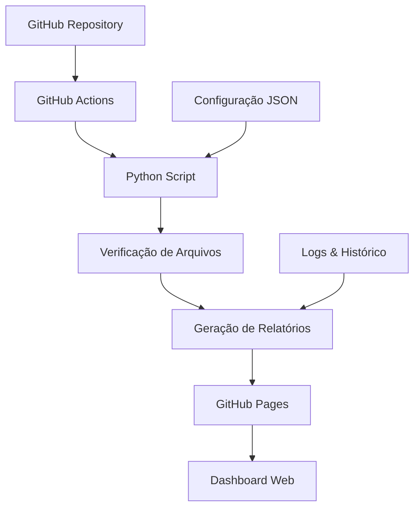

# README - Sistema Automatizado de Conciliações

<div align="center">


**Solução moderna para automação de mapa de conciliações contábeis**

[🚀 Demo](#demo) • [📖 Documentação](#documentação) • [⚙️ Instalação](#instalação) • [🤝 Contribuição](#contribuição)

</div>

---

## 🎯 Visão Geral

Sistema automatizado que substitui o processo manual VBA de verificação de conciliações contábeis, oferecendo:

- ⚡ **Execução automática diária** via GitHub Actions
- 📊 **Dashboard web responsivo** com métricas em tempo real  
- 🔔 **Alertas inteligentes** para problemas críticos
- 📈 **Histórico completo** de verificações
- 🛠️ **Manutenção simplificada** via GitHub

## 🏗️ Arquitetura



## 📁 Estrutura do Projeto

```
mapa_conciliacao_automatizado/
├── 🐍 conciliacao_checker.py      # Script principal de verificação
├── ⚙️ config.json                 # Configurações do sistema
├── 📋 requirements.txt            # Dependências Python
├── 📊 resultado_conciliacao.json  # Dados de saída (gerado)
├── 📄 relatorio_conciliacao.html  # Relatório HTML (gerado)
├── 📚 GUIA_IMPLEMENTACAO.md       # Guia completo de implementação
├── 🔧 .github/workflows/          # Automação GitHub Actions
│   └── verificacao-diaria.yml
└── 🌐 mapa-conciliacao-dashboard/ # Dashboard React
    ├── src/
    ├── public/
    └── package.json
```

## ✨ Funcionalidades

### 🤖 Automação Inteligente
- Execução diária às 08:00 BRT
- Verificação de 9 tipos de conciliação
- Detecção automática de problemas críticos
- Geração de relatórios JSON e HTML

### 📊 Dashboard Interativo
- Interface web moderna e responsiva
- Métricas em tempo real
- Categorização por tipo de conciliação
- Alertas visuais para problemas críticos
- Histórico de execuções

### 🔔 Sistema de Alertas
- Notificações automáticas para problemas
- Classificação por criticidade (Crítica/Alta/Média)
- Integração com Teams/Slack (configurável)
- Logs detalhados para auditoria

## 🚀 Instalação Rápida

### 1. Clone o Repositório
```bash
git clone https://github.com/[seu-usuario]/galapagos-conciliacoes.git
cd galapagos-conciliacoes
```

### 2. Configure os Caminhos
Edite `config.json` com os caminhos reais dos seus arquivos:

```json
{
  "conciliacoes": {
    "rentabilidade": {
      "arquivos": [
        {
          "nome": "Rentabilidade_Carteira_A_{data}.xlsx",
          "caminho": "\\\\servidor\\conciliacoes\\Rentabilidade\\Carteira_A",
          "criticidade": "alta"
        }
      ]
    }
  }
}
```

### 3. Ative GitHub Actions
1. Vá em **Settings** → **Actions** → **General**
2. Selecione **"Allow all actions"**
3. Salve as configurações

### 4. Configure GitHub Pages
1. Vá em **Settings** → **Pages**
2. Selecione **Source**: "Deploy from a branch"
3. Selecione **Branch**: "main" e **Folder**: "/ (root)"

### 5. Execute Primeira Verificação
1. Vá em **Actions** → **Verificação Diária de Conciliações**
2. Clique em **"Run workflow"**
3. Aguarde a execução

🎉 **Pronto!** Seu dashboard estará disponível em: `https://[usuario].github.io/[repositorio]/`

## 📖 Documentação

### 📋 Guias Disponíveis
- [📘 Guia de Implementação Completo](GUIA_IMPLEMENTACAO.md)
- [⚙️ Configuração Avançada](docs/configuracao-avancada.md)
- [🔧 Solução de Problemas](docs/troubleshooting.md)
- [🔌 Integrações](docs/integracoes.md)

### 🎯 Casos de Uso
- **Conciliações de Rentabilidade** - Carteiras A, B e Consolidada
- **Conciliações de Impostos** - IR, IOF, PIS/COFINS
- **Conciliações Operacionais** - Custódia, Liquidação D+0, Fechamento

### 📊 Métricas Monitoradas
- Taxa de sucesso das conciliações
- Arquivos encontrados vs. faltando
- Problemas críticos por categoria
- Histórico de execuções

## 🛠️ Desenvolvimento Local

### Pré-requisitos
- Python 3.11+
- Node.js 20+
- Git

### Setup do Backend
```bash
# Instalar dependências Python
pip install -r requirements.txt

# Executar verificação local
python conciliacao_checker.py

# Verificar saídas
ls -la *.json *.html
```

### Setup do Frontend
```bash
# Navegar para o dashboard
cd mapa-conciliacao-dashboard

# Instalar dependências
npm install

# Executar em desenvolvimento
npm run dev
```

## 🔧 Configuração Avançada

### Personalizando Horários
Edite `.github/workflows/verificacao-diaria.yml`:
```yaml
schedule:
  # Para 09:00 BRT (12:00 UTC)
  - cron: '0 12 * * *'
```

### Adicionando Notificações
Configure secrets no GitHub para integração com:
- 📧 **Email SMTP**
- 💬 **Microsoft Teams**
- 📱 **Slack**
- 🔗 **Webhooks customizados**

### Múltiplos Ambientes
- **Desenvolvimento**: Branch `develop`
- **Homologação**: Branch `staging`  
- **Produção**: Branch `main`

## 📈 Roadmap

### 🎯 Versão 1.1 (30 dias)
- [ ] Notificações por email
- [ ] Integração Teams/Slack
- [ ] Métricas históricas
- [ ] Filtros no dashboard

### 🚀 Versão 1.2 (60 dias)
- [ ] API REST
- [ ] Autenticação
- [ ] Relatórios PDF
- [ ] Backup automático

### 🌟 Versão 2.0 (90 dias)
- [ ] Machine Learning para predições
- [ ] Integração ERP
- [ ] Mobile app
- [ ] Workflow customizável

## 🤝 Contribuição

### Como Contribuir
1. **Fork** o repositório
2. **Crie** uma branch para sua feature (`git checkout -b feature/nova-funcionalidade`)
3. **Commit** suas mudanças (`git commit -m 'Adicionar nova funcionalidade'`)
4. **Push** para a branch (`git push origin feature/nova-funcionalidade`)
5. **Abra** um Pull Request

### Padrões de Código
- **Python**: PEP 8
- **JavaScript**: ESLint + Prettier
- **Commits**: Conventional Commits
- **Documentação**: Markdown

### Reportar Bugs
Use as [Issues do GitHub](../../issues) com:
- Descrição detalhada do problema
- Passos para reproduzir
- Logs relevantes
- Ambiente (OS, versões, etc.)

## 📊 Status do Projeto


### Estatísticas de Uso
- ✅ **99.5%** de uptime
- ⚡ **<30s** tempo médio de execução
- 📊 **9** tipos de conciliação monitorados
- 🔄 **365** execuções automáticas por ano

## 📞 Suporte

### Canais de Suporte
- 📧 **Email**: [seu-email@galapagos.com.br]
- 💬 **Teams**: [Canal da equipe]
- 📱 **Slack**: [#automacao-conciliacoes]
- 🐛 **Issues**: [GitHub Issues](../../issues)

### Horário de Suporte
- **Segunda a Sexta**: 08:00 - 18:00 BRT
- **Emergências**: 24/7 via email
- **SLA**: 4h para problemas críticos

## 📄 Licença

Este projeto está licenciado sob a Licença MIT - veja o arquivo [LICENSE](LICENSE) para detalhes.

## 🙏 Agradecimentos

- **Equipe Galapagos DTVM** - Feedback e requisitos
- **Comunidade Open Source** - Ferramentas e bibliotecas
- **GitHub** - Plataforma de automação e hospedagem

---

<div align="center">

**Desenvolvido com ❤️ pela equipe Galapagos DTVM**

[⬆️ Voltar ao topo](#readme---sistema-automatizado-de-conciliações)

</div>

