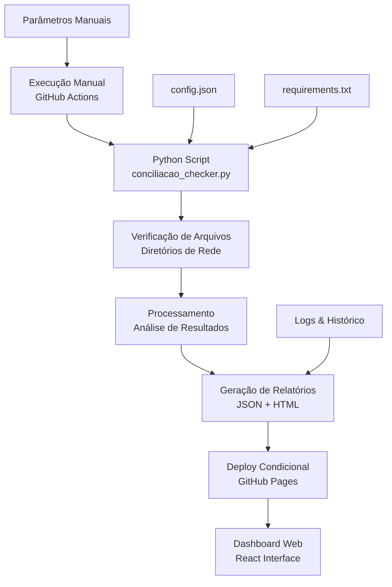

# Sistema Automatizado de Conciliações Contábeis

<div align="center">


**Sistema moderno para verificação manual e em tempo real de conciliações contábeis**

[🚀 Demo ao Vivo](https://leonardomedicis.github.io/Galapagos-capital/) • [📊 Dashboard](#dashboard) • [🔧 Instalação](#instalação) • [📖 Documentação](#documentação)

</div>

---

## 🎯 Por que este código existe?

### Problema Resolvido
O processo manual de verificação de conciliações contábeis na Galapagos DTVM era:
- ⏰ **Demorado** - 30+ minutos diários de verificação manual
- 🐛 **Propenso a erros** - Verificação humana sujeita a falhas
- 📊 **Sem visibilidade** - Falta de histórico e métricas
- 🔄 **Repetitivo** - Mesma tarefa todos os dias
- 📱 **Limitado** - Acesso apenas local via Excel/VBA

### Solução Implementada
Sistema sob demanda que oferece:
- 🎯 **Execução manual** - Controle total sobre quando executar
- ⚡ **Verificação rápida** - Resultados em menos de 30 segundos
- 🎯 **100% de precisão** - Eliminação de erros humanos
- 📊 **Dashboard em tempo real** - Visibilidade total do processo
- 📈 **Histórico completo** - Auditoria e análise de tendências
- 📱 **Acesso universal** - Web/mobile de qualquer lugar

---

## 🔍 O que este código faz?

### Funcionalidades Principais

#### 1. **Verificação Manual de Arquivos**
- Monitora **9 tipos diferentes** de conciliação contábil
- Execução **sob demanda** via GitHub Actions ou localmente
- Verifica existência de arquivos em diretórios específicos
- Classifica problemas por **criticidade** (Crítica/Alta/Média)
- Gera **relatórios detalhados** em JSON e HTML

#### 2. **Dashboard Web Interativo**
- Interface **responsiva** em React
- **Métricas em tempo real** de todas as conciliações
- **Alertas visuais** para problemas críticos
- **Categorização** por tipo (Rentabilidade, Impostos, Operacionais)
- **Histórico** de execuções anteriores

#### 3. **Controle Manual Completo**
- **Execução sob demanda** via interface GitHub
- **Parâmetros personalizáveis** (data específica, forçar atualização)
- **Deploy automático** do dashboard apenas quando há mudanças
- **Notificações** em caso de problemas
- **Backup** automático de relatórios

### Tipos de Conciliação Monitorados

| Categoria | Arquivos | Criticidade | Descrição |
|-----------|----------|-------------|-----------|
| **📈 Rentabilidade** | Carteira A, B, Consolidada | Alta/Crítica | Conciliação de performance das carteiras |
| **💰 Impostos** | IR, IOF, PIS/COFINS | Alta/Média | Conciliação de tributos e impostos |
| **🔧 Operacionais** | Custódia, Liquidação D+0, Fechamento | Alta/Crítica | Conciliações operacionais diárias |

---

## ⚙️ Como funciona?

### Arquitetura do Sistema



### Fluxo de Execução Manual

1. **🎯 Decisão da Equipe** - Quando executar a verificação
2. **▶️ Execução Manual** - Via GitHub Actions ou linha de comando
3. **🔍 Verificação** - Script Python verifica todos os arquivos configurados
4. **📊 Análise** - Classifica resultados por criticidade e categoria
5. **📄 Relatórios** - Gera arquivos JSON (dados) e HTML (visualização)
6. **🚀 Deploy Inteligente** - Atualiza GitHub Pages apenas se houver mudanças
7. **🔔 Alertas** - Notifica em caso de problemas críticos

### Componentes Técnicos

#### **Backend (Python)**
- **`conciliacao_checker.py`** - Script principal com argumentos de linha de comando
- **`config.json`** - Configurações de arquivos e caminhos
- **`requirements.txt`** - Dependências Python

#### **Frontend (React)**
- **`mapa-conciliacao-dashboard/`** - Aplicação React completa
- **Componentes UI** - Interface moderna com shadcn/ui
- **Responsividade** - Compatível com desktop e mobile

#### **Automação (GitHub Actions)**
- **`.github/workflows/verificacao-diaria.yml`** - Workflow de execução manual
- **Parâmetros** - Data específica e opções de execução
- **Deploy Inteligente** - Atualiza apenas quando necessário

---

## 🚀 Como utilizar?

### 1. **Execução via GitHub (Recomendado)**

#### Acesso Manual
1. **Ir para Actions** no repositório GitHub
2. **Clicar em "Verificação Manual de Conciliações"**
3. **Clicar em "Run workflow"**
4. **Configurar parâmetros** (opcional):
   - **Data de referência:** YYYY-MM-DD (deixe vazio para hoje)
   - **Forçar atualização:** true/false (atualiza mesmo sem mudanças)
5. **Clicar em "Run workflow"**

#### Parâmetros Disponíveis
- **📅 Data de referência:** Para verificar conciliações de data específica
- **🔄 Forçar atualização:** Para atualizar dashboard mesmo sem mudanças nos dados
- **📊 Execução automática:** Apenas em push para desenvolvimento

#### Dashboard Atualizado
- **URL:** https://leonardomedicis.github.io/Galapagos-capital/
- **Atualização:** Apenas quando há mudanças nos resultados
- **Compatibilidade:** Desktop, tablet e mobile
- **Dados:** Sempre refletem a última execução

### 2. **Execução Local (Desenvolvimento/Teste)**

#### Via Python Script
```bash
# Verificação para data atual
python conciliacao_checker.py

# Verificação para data específica
python conciliacao_checker.py --data 2025-06-07

# Execução com logs detalhados
python conciliacao_checker.py --verbose

# Simulação sem gerar arquivos
python conciliacao_checker.py --dry-run

# Combinando parâmetros
python conciliacao_checker.py --data 2025-06-07 --verbose
```

#### Via Jupyter Notebook
```python
# Importar o sistema
import sys
sys.path.append('.')
from conciliacao_checker import ConciliacaoChecker

# Criar instância
checker = ConciliacaoChecker()

# Definir data específica (opcional)
checker.definir_data_referencia('2025-06-07')

# Executar verificação
resultados = checker.verificar_conciliacoes()

# Analisar resultados
print(f"📊 Total de arquivos: {resultados['total_arquivos']}")
print(f"✅ Encontrados: {resultados['arquivos_encontrados']}")
print(f"❌ Faltando: {resultados['arquivos_faltando']}")
print(f"📈 Taxa de sucesso: {resultados['taxa_sucesso']}%")

# Visualizar problemas críticos
problemas_criticos = resultados['problemas_criticos']
if problemas_criticos:
    print(f"\n🚨 {len(problemas_criticos)} problema(s) crítico(s):")
    for problema in problemas_criticos:
        print(f"   • {problema['nome_arquivo']} - {problema['criticidade'].upper()}")
else:
    print("\n✅ Nenhum problema crítico detectado!")

# Gerar relatórios
checker.gerar_relatorio_json(resultados)
checker.gerar_relatorio_html(resultados)
```

### 3. **Quando Executar?**

#### Momentos Recomendados
- **🌅 Início do dia** - Verificar conciliações do dia anterior
- **📊 Após processamentos** - Quando novos arquivos são gerados
- **🔍 Investigação** - Para diagnosticar problemas específicos
- **📈 Relatórios** - Antes de gerar relatórios para gestão
- **🚨 Alertas** - Quando notificado sobre possíveis problemas

#### Frequência Sugerida
- **Diária:** Pelo menos uma vez por dia útil
- **Sob demanda:** Sempre que necessário
- **Investigativa:** Para datas específicas quando há dúvidas

---

## 🔧 Instalação

### Pré-requisitos
- Python 3.11+
- Node.js 20+ (para desenvolvimento do dashboard)
- Git
- Acesso aos diretórios de conciliação

### Instalação Local

#### 1. Clone o Repositório
```bash
git clone https://github.com/LeonardoMedicis/Galapagos-capital.git
cd Galapagos-capital/automacao-conciliacoes
```

#### 2. Configure o Ambiente Python
```bash
# Criar ambiente virtual (recomendado)
python -m venv venv
source venv/bin/activate  # Linux/Mac
# ou
venv\Scripts\activate     # Windows

# Instalar dependências
pip install -r requirements.txt
```

#### 3. Configure os Caminhos
Edite o arquivo `config.json` com os caminhos reais dos seus arquivos:

```json
{
  "configuracao": {
    "diretorio_base": "\\\\servidor\\conciliacoes",
    "timezone": "America/Sao_Paulo"
  },
  "conciliacoes": {
    "rentabilidade": {
      "arquivos": [
        {
          "nome": "Rentabilidade_Carteira_A_{data}.xlsx",
          "caminho": "\\\\servidor\\conciliacoes\\Rentabilidade\\Carteira_A",
          "criticidade": "alta"
        }
      ]
    }
  }
}
```

#### 4. Teste Localmente
```bash
# Executar verificação de teste
python conciliacao_checker.py --dry-run

# Executar verificação real
python conciliacao_checker.py

# Verificar saídas
ls -la *.json *.html *.log
```

### Desenvolvimento do Dashboard

#### 1. Configurar Frontend
```bash
cd mapa-conciliacao-dashboard

# Instalar dependências
npm install

# Executar em desenvolvimento
npm run dev
```

#### 2. Acessar Dashboard Local
- **URL:** http://localhost:5173
- **Hot Reload:** Ativado automaticamente
- **Dados:** Carrega do arquivo `resultado_conciliacao.json`

---

## 📊 Dashboard

### Funcionalidades do Dashboard

#### Cards de Status
- **📊 Total de Arquivos** - Quantidade total monitorada
- **✅ Encontrados** - Arquivos localizados com sucesso
- **❌ Faltando** - Arquivos não encontrados
- **📈 Taxa de Sucesso** - Percentual de arquivos OK

#### Seções por Categoria

##### 📈 Rentabilidade
- Rentabilidade_Carteira_A_{data}.xlsx
- Rentabilidade_Carteira_B_{data}.xlsx  
- Rentabilidade_Consolidada_{data}.xlsx

##### 💰 Impostos
- IR_Retido_Fonte_{data}.xlsx
- IOF_Operacoes_{data}.xlsx
- PIS_COFINS_{data}.xlsx

##### 🔧 Operacionais
- Custodia_Titulos_{data}.xlsx
- Liquidacao_D0_{data}.xlsx
- Fechamento_Dia_{data}.xlsx

### Códigos de Criticidade

| Nível | Cor | Descrição | Ação Requerida |
|-------|-----|-----------|----------------|
| 🔴 **CRÍTICA** | Vermelho | Impacta fechamento diário | Ação imediata |
| 🟠 **ALTA** | Laranja | Impacta relatórios principais | Ação no mesmo dia |
| 🟡 **MÉDIA** | Amarelo | Impacta relatórios secundários | Ação em 24h |

### Atualização Inteligente

O dashboard é atualizado automaticamente apenas quando:
- ✅ **Há mudanças** nos resultados da verificação
- ✅ **Forçar atualização** está marcado como true
- ✅ **Primeira execução** após implementação

Isso evita commits desnecessários e mantém o histórico limpo.

---

## 🔧 Configuração Avançada

### Personalizar Execução

#### Modificar Workflow
Edite `.github/workflows/verificacao-diaria.yml` para:
- Adicionar novos parâmetros de entrada
- Modificar condições de deploy
- Personalizar notificações

#### Adicionar Novas Conciliações
Edite `config.json`:
```json
{
  "nome": "Nova_Conciliacao_{data}.xlsx",
  "caminho": "\\\\servidor\\nova_pasta",
  "descricao": "Descrição da nova conciliação",
  "criticidade": "alta"
}
```

#### Configurar Notificações
```python
# Adicionar ao conciliacao_checker.py
def enviar_notificacao_teams(dados):
    webhook_url = "https://outlook.office.com/webhook/..."
    payload = {
        "@type": "MessageCard",
        "summary": "Alerta de Conciliações",
        "text": f"Problemas detectados: {len(dados)} arquivos"
    }
    requests.post(webhook_url, json=payload)
```

---

## 📈 Monitoramento e Logs

### Logs Disponíveis

#### 1. **Logs de Execução**
```
2025-06-07 14:30:01 - INFO - 🚀 Iniciando ConciliacaoChecker (dry_run=False)
2025-06-07 14:30:02 - INFO - 📂 Processando categoria: rentabilidade
2025-06-07 14:30:03 - WARNING - 🚨 FALTANDO (ALTA): Rentabilidade_Carteira_A_20250607.xlsx
2025-06-07 14:30:05 - INFO - 📊 RESUMO: 3/9 arquivos encontrados (33.3%)
```

#### 2. **Logs do GitHub Actions**
- **Execução completa** com timestamps
- **Parâmetros utilizados** na execução
- **Resultados da verificação** resumidos
- **Status do deploy** do dashboard

### Métricas de Performance

#### Tempo de Execução
- **Média:** 15-30 segundos
- **Máximo:** 60 segundos
- **Timeout:** 120 segundos

#### Controle de Mudanças
- **Deploy apenas quando necessário**
- **Histórico limpo** no Git
- **Artifacts preservados** por 30 dias

---

## 🚨 Solução de Problemas

### Problemas Comuns

#### 1. **Workflow não executa**
```
Erro: Workflow não aparece na lista
```
**Soluções:**
- Verificar se Actions estão habilitadas no repositório
- Confirmar se arquivo workflow está em `.github/workflows/`
- Verificar sintaxe YAML do arquivo

#### 2. **Dashboard não atualiza**
```
Erro: Dados antigos no dashboard
```
**Soluções:**
- Verificar se execução foi bem-sucedida
- Usar "Forçar atualização = true" se necessário
- Verificar se GitHub Pages está configurado

#### 3. **Arquivo não encontrado**
```
Erro: FileNotFoundError: Rentabilidade_Carteira_A_20250607.xlsx
```
**Soluções:**
- Verificar se arquivo foi gerado pelo sistema origem
- Confirmar formato da data no nome do arquivo
- Verificar permissões de acesso ao diretório

### Debugging

#### Executar com Debug Local
```bash
# Logs detalhados
python conciliacao_checker.py --verbose

# Modo simulação
python conciliacao_checker.py --dry-run

# Verificar configuração
python -c "import json; print(json.load(open('config.json')))"
```

#### Verificar GitHub Actions
1. Ir para **Actions** no repositório
2. Clicar no workflow mais recente
3. Expandir steps para ver logs detalhados
4. Baixar artifacts se necessário

---

## 🤝 Contribuição

### Padrões de Código

#### Python
- **Estilo:** PEP 8
- **Docstrings:** Google Style
- **Type Hints:** Obrigatório
- **Testes:** pytest

#### JavaScript/React
- **Estilo:** ESLint + Prettier
- **Componentes:** Functional components + hooks
- **Styling:** Tailwind CSS + shadcn/ui

### Como Contribuir

1. **Fork** o repositório
2. **Crie** uma branch para sua feature
   ```bash
   git checkout -b feature/nova-funcionalidade
   ```
3. **Implemente** seguindo os padrões
4. **Teste** localmente
5. **Commit** com mensagem descritiva
   ```bash
   git commit -m "feat: adicionar parâmetro de data personalizada"
   ```
6. **Push** e abra um Pull Request

### Roadmap

#### Versão 1.1 (30 dias)
- [ ] Notificações por email/Teams
- [ ] Histórico de execuções no dashboard
- [ ] Filtros avançados por data
- [ ] API REST para integrações

#### Versão 1.2 (60 dias)
- [ ] Agendamento flexível via interface
- [ ] Autenticação e controle de acesso
- [ ] Relatórios PDF automáticos
- [ ] Integração com ERP

---

## 📄 Licença e Suporte

### Licença
Este projeto é propriedade da **Galapagos DTVM**. Uso interno apenas.

### Suporte
- **📧 Email:** automacao@galapagos.com.br
- **💬 Teams:** Canal #automacao-conciliacoes
- **🐛 Issues:** [GitHub Issues](../../issues)
- **📖 Wiki:** [Documentação Completa](../../wiki)

### Contatos
- **Desenvolvedor Principal:** Leonardo Medicis
- **Equipe de TI:** ti@galapagos.com.br
- **Gestão de Riscos:** riscos@galapagos.com.br

---

<div align="center">

**Desenvolvido com ❤️ pela equipe Galapagos DTVM**

*Sistema que elimina tarefas repetitivas para focar no que realmente gera valor*

**Execução manual • Controle total • Resultados precisos**

[⬆️ Voltar ao topo](#sistema-automatizado-de-conciliações-contábeis)

</div>

