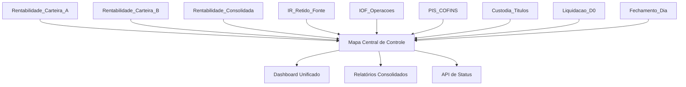

# Módulos de Conciliação - Galapagos DTVM

<div align="center">


**Estrutura modular para desenvolvimento independente de cada conciliação**

[🏗️ Arquitetura](#arquitetura) • [📁 Estrutura](#estrutura) • [🔧 Como Desenvolver](#como-desenvolver) • [📖 Padrões](#padrões)

</div>

---

## 🎯 Visão Geral

Esta pasta contém **módulos independentes** para cada tipo de conciliação contábil da Galapagos DTVM. Cada módulo pode ser desenvolvido, testado e executado de forma independente, mas todos se conectam ao **mapa central de controle** para visibilidade unificada.

---

## 🏗️ Arquitetura Modular

### Conceito


### Benefícios
- ✅ **Desenvolvimento independente** de cada conciliação
- ✅ **Testes isolados** por módulo
- ✅ **Deploy granular** apenas do que mudou
- ✅ **Manutenção simplificada** de código específico
- ✅ **Escalabilidade** para novas conciliações
- ✅ **Visibilidade unificada** no dashboard central

---

## 📁 Estrutura de Módulos

### Módulos Disponíveis

| Módulo | Categoria | Criticidade | Status | Responsável |
|--------|-----------|-------------|---------|-------------|
| **📈 Rentabilidade_Carteira_A** | Rentabilidade | Alta | 🏗️ Estrutura Pronta | - |
| **📈 Rentabilidade_Carteira_B** | Rentabilidade | Alta | 🏗️ Estrutura Pronta | - |
| **📈 Rentabilidade_Consolidada** | Rentabilidade | Crítica | 🏗️ Estrutura Pronta | - |
| **💰 IR_Retido_Fonte** | Impostos | Alta | 🏗️ Estrutura Pronta | - |
| **💰 IOF_Operacoes** | Impostos | Média | 🏗️ Estrutura Pronta | - |
| **💰 PIS_COFINS** | Impostos | Média | 🏗️ Estrutura Pronta | - |
| **🔧 Custodia_Titulos** | Operacional | Média | 🏗️ Estrutura Pronta | - |
| **🔧 Liquidacao_D0** | Operacional | Alta | 🏗️ Estrutura Pronta | - |
| **🔧 Fechamento_Dia** | Operacional | Crítica | 🏗️ Estrutura Pronta | - |

### Estrutura Padrão de Cada Módulo
```
Rentabilidade_Carteira_A/
├── 📖 README.md                # Documentação específica
├── 🐍 conciliacao.py          # Lógica principal de negócio
├── ⚙️ config.json             # Configurações específicas
├── 📊 dados/                  # Dados de entrada e saída
│   ├── entrada/               # Arquivos de input
│   ├── saida/                 # Resultados processados
│   └── historico/             # Backup de execuções
├── 🧪 tests/                  # Testes unitários
│   ├── test_conciliacao.py    # Testes principais
│   ├── test_data/             # Dados para teste
│   └── conftest.py            # Configurações pytest
├── 📚 docs/                   # Documentação técnica
│   ├── regras_negocio.md      # Regras específicas
│   ├── fluxo_processo.md      # Fluxo detalhado
│   └── troubleshooting.md     # Solução de problemas
├── 📓 notebooks/              # Análises exploratórias
│   ├── analise_dados.ipynb    # Análise de dados
│   └── validacao_regras.ipynb # Validação de regras
└── 🔧 utils/                  # Utilitários específicos
    ├── __init__.py
    ├── data_processor.py      # Processamento de dados
    └── validators.py          # Validadores específicos
```

---

## 🔧 Como Desenvolver um Módulo

### 1. Escolher Módulo
```bash
# Navegar para o módulo desejado
cd conciliacoes/Rentabilidade_Carteira_A
```

### 2. Implementar Lógica Principal
```python
# conciliacao.py - Template base
from datetime import datetime
from typing import Dict, Any, Optional
import sys
import os

# Adicionar path do mapa central
sys.path.append(os.path.join(os.path.dirname(__file__), '..', '..', 'automacao-conciliacoes'))
from shared.base_conciliacao import BaseConciliacao
from shared.status_reporter import StatusReporter

class RentabilidadeCarteiraA(BaseConciliacao):
    """
    Conciliação específica da Rentabilidade da Carteira A.
    
    Esta classe implementa a lógica específica para verificar e processar
    a conciliação de rentabilidade da Carteira A.
    """
    
    def __init__(self):
        super().__init__(
            nome="Rentabilidade_Carteira_A",
            categoria="rentabilidade", 
            criticidade="alta"
        )
        self.status_reporter = StatusReporter()
    
    def executar_conciliacao(self, data_referencia: Optional[str] = None) -> Dict[str, Any]:
        """
        Executa a conciliação específica da Carteira A.
        
        Args:
            data_referencia: Data no formato YYYY-MM-DD
            
        Returns:
            Dict com resultados da conciliação
        """
        try:
            # 1. Reportar início
            self.status_reporter.reportar_inicio(self.nome)
            
            # 2. Carregar dados
            dados = self._carregar_dados(data_referencia)
            
            # 3. Executar validações
            resultados = self._executar_validacoes(dados)
            
            # 4. Gerar relatório
            relatorio = self._gerar_relatorio(resultados)
            
            # 5. Reportar sucesso
            self.status_reporter.reportar_sucesso(self.nome, resultados)
            
            return resultados
            
        except Exception as e:
            # Reportar erro
            self.status_reporter.reportar_erro(self.nome, str(e))
            raise
    
    def _carregar_dados(self, data_referencia: str) -> Dict[str, Any]:
        """Implementar lógica específica de carregamento."""
        # TODO: Implementar carregamento específico
        pass
    
    def _executar_validacoes(self, dados: Dict[str, Any]) -> Dict[str, Any]:
        """Implementar validações específicas."""
        # TODO: Implementar validações específicas
        pass
    
    def _gerar_relatorio(self, resultados: Dict[str, Any]) -> str:
        """Implementar geração de relatório específico."""
        # TODO: Implementar relatório específico
        pass

if __name__ == "__main__":
    conciliacao = RentabilidadeCarteiraA()
    resultado = conciliacao.executar_conciliacao()
    print(f"Conciliação executada: {resultado}")
```

### 3. Configurar Módulo
```json
// config.json - Configurações específicas
{
  "modulo": {
    "nome": "Rentabilidade_Carteira_A",
    "categoria": "rentabilidade",
    "criticidade": "alta",
    "versao": "1.0.0"
  },
  "dados": {
    "arquivo_entrada": "Rentabilidade_Carteira_A_{data}.xlsx",
    "caminho_entrada": "C:\\Conciliacoes\\Rentabilidade\\Carteira_A",
    "formato_data": "%Y%m%d",
    "colunas_obrigatorias": [
      "data",
      "ativo",
      "quantidade", 
      "preco",
      "valor_mercado"
    ]
  },
  "validacoes": {
    "tolerancia_percentual": 0.01,
    "valor_minimo": 1000.00,
    "verificar_duplicatas": true,
    "validar_datas": true
  },
  "saida": {
    "gerar_relatorio_pdf": true,
    "enviar_email": false,
    "salvar_historico": true
  },
  "integracao": {
    "reportar_status_central": true,
    "timeout_execucao": 300,
    "retry_attempts": 3
  }
}
```

### 4. Documentar Módulo
```markdown
# Rentabilidade Carteira A

## 🎯 Objetivo
Conciliar dados de rentabilidade da Carteira A com sistemas fonte.

## 📊 Dados Processados
- **Fonte:** Sistema de Gestão de Carteiras
- **Arquivo:** Rentabilidade_Carteira_A_{data}.xlsx
- **Frequência:** Diária
- **Criticidade:** Alta

## 🔍 Validações Implementadas
1. **Integridade dos dados** - Verificar colunas obrigatórias
2. **Consistência temporal** - Validar sequência de datas
3. **Limites de tolerância** - Verificar variações aceitáveis
4. **Duplicatas** - Identificar registros duplicados

## 🚀 Como Executar
```bash
# Execução direta
python conciliacao.py

# Com data específica
python conciliacao.py --data 2025-06-07

# Modo debug
python conciliacao.py --debug
```

## 📈 Métricas
- **Tempo médio:** 30 segundos
- **Taxa de sucesso:** 98%
- **Registros processados:** ~1000/dia
```

### 5. Implementar Testes
```python
# tests/test_conciliacao.py
import pytest
from datetime import datetime
import sys
import os

# Adicionar path do módulo
sys.path.append(os.path.dirname(os.path.dirname(__file__)))
from conciliacao import RentabilidadeCarteiraA

class TestRentabilidadeCarteiraA:
    
    def setup_method(self):
        """Setup para cada teste."""
        self.conciliacao = RentabilidadeCarteiraA()
    
    def test_inicializacao(self):
        """Testa inicialização do módulo."""
        assert self.conciliacao.nome == "Rentabilidade_Carteira_A"
        assert self.conciliacao.categoria == "rentabilidade"
        assert self.conciliacao.criticidade == "alta"
    
    def test_carregar_dados_validos(self):
        """Testa carregamento de dados válidos."""
        # TODO: Implementar teste com dados mock
        pass
    
    def test_validacoes_basicas(self):
        """Testa validações básicas."""
        # TODO: Implementar testes de validação
        pass
    
    def test_gerar_relatorio(self):
        """Testa geração de relatório."""
        # TODO: Implementar teste de relatório
        pass
```

---

## 🔗 Integração com Mapa Central

### Sistema de Comunicação
Cada módulo se comunica com o mapa central através de:

#### 1. Status Reporter
```python
from shared.status_reporter import StatusReporter

reporter = StatusReporter()

# Reportar início
reporter.reportar_inicio("Rentabilidade_Carteira_A")

# Reportar progresso
reporter.reportar_progresso("Rentabilidade_Carteira_A", 50, "Validando dados...")

# Reportar sucesso
reporter.reportar_sucesso("Rentabilidade_Carteira_A", resultados)

# Reportar erro
reporter.reportar_erro("Rentabilidade_Carteira_A", "Erro na validação")
```

#### 2. API de Status
```python
# GET /api/status/Rentabilidade_Carteira_A
{
  "nome": "Rentabilidade_Carteira_A",
  "status": "executando",
  "progresso": 75,
  "mensagem": "Gerando relatório...",
  "inicio": "2025-06-07T14:30:00",
  "ultima_atualizacao": "2025-06-07T14:32:15"
}
```

#### 3. Dashboard em Tempo Real
- **Status visual** de cada módulo
- **Progresso em tempo real** durante execução
- **Logs centralizados** de todas as execuções
- **Métricas consolidadas** por categoria

---

## 📋 Padrões de Desenvolvimento

### Nomenclatura
- **Classes:** PascalCase (`RentabilidadeCarteiraA`)
- **Métodos:** snake_case (`executar_conciliacao`)
- **Arquivos:** snake_case (`conciliacao.py`)
- **Constantes:** UPPER_CASE (`TIMEOUT_DEFAULT`)

### Estrutura de Código
```python
# 1. Imports padrão
import os
import sys
from datetime import datetime
from typing import Dict, Any, Optional

# 2. Imports de terceiros
import pandas as pd
import numpy as np

# 3. Imports locais
from shared.base_conciliacao import BaseConciliacao
from utils.data_processor import DataProcessor

# 4. Constantes
TIMEOUT_DEFAULT = 300
TOLERANCIA_PADRAO = 0.01

# 5. Classe principal
class MinhaClass(BaseConciliacao):
    pass
```

### Tratamento de Erros
```python
try:
    resultado = self._processar_dados(dados)
except FileNotFoundError as e:
    self.logger.error(f"Arquivo não encontrado: {e}")
    self.status_reporter.reportar_erro(self.nome, f"Arquivo não encontrado: {e}")
    raise
except ValidationError as e:
    self.logger.warning(f"Erro de validação: {e}")
    self.status_reporter.reportar_erro(self.nome, f"Validação falhou: {e}")
    raise
except Exception as e:
    self.logger.error(f"Erro inesperado: {e}")
    self.status_reporter.reportar_erro(self.nome, f"Erro inesperado: {e}")
    raise
```

---

## 🚀 Execução dos Módulos

### Execução Individual
```bash
# Executar módulo específico
cd conciliacoes/Rentabilidade_Carteira_A
python conciliacao.py

# Com parâmetros
python conciliacao.py --data 2025-06-07 --debug
```

### Execução via Mapa Central
```bash
# Executar todos os módulos
cd automacao-conciliacoes
python mapa_central.py --all

# Executar por categoria
python mapa_central.py --categoria rentabilidade

# Executar módulos específicos
python mapa_central.py --modulos "Rentabilidade_Carteira_A,IR_Retido_Fonte"
```

### Execução via GitHub Actions
```yaml
# Workflow para módulo específico
name: Executar Rentabilidade Carteira A
on:
  workflow_dispatch:
    inputs:
      data_referencia:
        description: 'Data de referência'
        required: false

jobs:
  executar:
    runs-on: ubuntu-latest
    steps:
      - uses: actions/checkout@v4
      - name: Executar módulo
        run: |
          cd conciliacoes/Rentabilidade_Carteira_A
          python conciliacao.py --data ${{ github.event.inputs.data_referencia }}
```

---

## 📊 Monitoramento e Métricas

### Dashboard Central
- **Status em tempo real** de todos os módulos
- **Métricas de performance** por módulo
- **Histórico de execuções** com filtros
- **Alertas automáticos** para falhas

### Logs Centralizados
```
2025-06-07 14:30:01 - INFO - [Rentabilidade_Carteira_A] Iniciando execução
2025-06-07 14:30:05 - INFO - [Rentabilidade_Carteira_A] Dados carregados: 1.234 registros
2025-06-07 14:30:15 - INFO - [Rentabilidade_Carteira_A] Validações concluídas: 100% OK
2025-06-07 14:30:25 - INFO - [Rentabilidade_Carteira_A] Relatório gerado com sucesso
2025-06-07 14:30:30 - INFO - [Rentabilidade_Carteira_A] Execução concluída em 29s
```

### Métricas Coletadas
- **Tempo de execução** por módulo
- **Taxa de sucesso** histórica
- **Volume de dados** processados
- **Frequência de erros** por tipo

---

## 🔮 Próximos Passos

### Desenvolvimento Imediato
1. **Implementar classes base** (`BaseConciliacao`, `StatusReporter`)
2. **Criar API de status** para comunicação
3. **Desenvolver primeiro módulo** como exemplo
4. **Configurar dashboard** para mostrar status em tempo real

### Expansão Futura
1. **Workflow engine** para processos complexos
2. **Scheduler inteligente** para execução otimizada
3. **Machine learning** para detecção de anomalias
4. **Integração com sistemas** externos

---

<div align="center">

**Estrutura modular pronta para desenvolvimento**

*Cada conciliação com seu próprio código, todas conectadas ao mapa central*

**Galapagos DTVM - Junho 2025**

</div>

